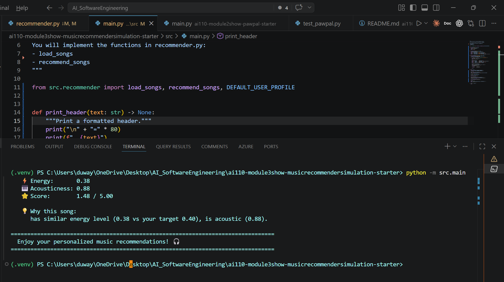

# 🎵 Music Recommender Simulation

## Project Summary

In this project you will build and explain a small music recommender system.

Your goal is to:

- Represent songs and a user "taste profile" as data
- Design a scoring rule that turns that data into recommendations
- Evaluate what your system gets right and wrong
- Reflect on how this mirrors real world AI recommenders

This music recommender uses content-based filtering to match songs to user preferences. It scores each song based on genre match (weight: 2.0), mood match (weight: 1.5), energy similarity (weight: 1.0), and acoustic preference (weight: 0.5). The system processes 20 diverse songs spanning multiple genres (lofi, pop, rock, jazz, hip-hop, EDM, country, metal, folk, reggae, blues, k-pop) and moods. While transparent and explainable, the system has known biases including over-prioritization of genre matches and dependency on exact categorical matches, which may cause it to miss excellent cross-genre recommendations.

---

## How The System Works

### Understanding Real-World Recommenders

Real-world recommenders like Spotify and YouTube use complex machine learning models trained on millions of user interactions. They employ collaborative filtering (learning from what similar users liked), content-based filtering (matching song attributes to user preferences), and hybrid approaches. These systems analyze listening history, skip rates, playlist additions, and contextual data to predict what users might enjoy next.

My version simplifies this by focusing on **content-based filtering**—matching song attributes directly to a user's stated preferences. Instead of learning from behavioral data, it prioritizes explicit musical features like genre, mood, and energy level to compute a similarity score. This makes the system transparent and explainable, though less personalized than real-world systems that learn from actual listening patterns.

### Feature Design

**Each `Song` object contains:**
- **genre** (categorical): Musical style (pop, lofi, rock, jazz, etc.)
- **mood** (categorical): Emotional tone (happy, chill, intense, focused, relaxed, moody)
- **energy** (numeric 0-1): Intensity and activity level of the track
- **valence** (numeric 0-1): Musical positiveness/happiness
- **danceability** (numeric 0-1): How suitable for dancing
- **acousticness** (numeric 0-1): Degree of acoustic vs. electronic production
- **tempo_bpm** (numeric): Speed in beats per minute
- **title**, **artist**, **id**: Metadata for identification

**Each `UserProfile` stores:**
- **favorite_genre** (string): User's preferred musical style
- **favorite_mood** (string): User's preferred emotional context
- **target_energy** (float 0-1): User's desired energy level
- **likes_acoustic** (boolean): Preference for acoustic vs. produced sound

### Algorithm Recipe

**Step-by-step scoring process:**

1. **Load Data**: Read all songs from `songs.csv` with their features (genre, mood, energy, acousticness, etc.)

2. **Get User Profile**: Accept user preferences (`favorite_genre`, `favorite_mood`, `target_energy`, `likes_acoustic`)

3. **For Each Song**, calculate the similarity score:
   
   ```
   score = 0
   
   # Genre matching (highest weight)
   if song.genre == user.favorite_genre:
       score += 2.0
   
   # Mood matching (second priority)
   if song.mood == user.favorite_mood:
       score += 1.5
   
   # Energy similarity (distance-based)
   energy_similarity = 1.0 - abs(user.target_energy - song.energy)
   score += 1.0 × energy_similarity
   
   # Acoustic preference bonus
   if user.likes_acoustic and song.acousticness > 0.5:
       score += 0.5
   elif not user.likes_acoustic and song.acousticness < 0.5:
       score += 0.5
   ```

4. **Sort & Rank**: Order all songs by score from highest to lowest

5. **Select Top K**: Return the top 5 (or K) highest-scoring songs

6. **Generate Explanations**: For each recommended song, explain which features matched the user's preferences

**Example Default Profile:**
```python
{
    "favorite_genre": "lofi",
    "favorite_mood": "chill", 
    "target_energy": 0.4,
    "likes_acoustic": True
}
```

### Potential Biases & Limitations

⚠️ **Known Biases in This System:**

- **Genre Over-prioritization**: The system gives the highest weight (2.0) to genre matching, which means excellent songs from other genres that perfectly match mood and energy may score lower than mediocre songs in the favorite genre.

- **Exact Match Dependency**: Genre and mood require exact string matches. A user who likes "lofi" won't get "chillhop" recommendations even though they're very similar styles.

- **Limited Acoustic Logic**: The boolean acoustic preference is oversimplified. Some users might enjoy both acoustic ballads and electronic dance music depending on context.

- **No Diversity in Recommendations**: The system always returns the highest-scoring songs, which could lead to repetitive recommendations with similar characteristics.

- **Cold Start Problem**: New users without defined preferences won't get meaningful recommendations. The default profile may not represent their actual tastes.

- **Ignores Temporal Context**: This system doesn't consider time of day, activity, or changing moods. A user might want energetic music for workouts but chill music for studying.

- **Small Catalog Bias**: With only 20 songs, the system's utility is limited. Some genres/moods may have few or no representatives.

### System Flow Diagram

For a detailed visualization of how songs move from the CSV file through the scoring process to the final ranked recommendations, see:

📊 **[System Design Diagram](SYSTEM_DESIGN.md)**

---


## Getting Started

### Setup

1. Create a virtual environment (optional but recommended):

   ```bash
   python -m venv .venv
   source .venv/bin/activate      # Mac or Linux
   .venv\Scripts\activate         # Windows

2. Install dependencies

```bash
pip install -r requirements.txt
```

3. Run the app:

```bash
python -m src.main
```

### Running Tests

Run the starter tests with:

```bash
pytest
```

You can add more tests in `tests/test_recommender.py`.

### Example Output

When you run the recommender with the default profile, you'll see a clean, formatted output like this:



The output displays:
- User profile preferences
- Top 5 ranked recommendations
- Detailed song information (artist, genre, mood, energy, acousticness)
- Similarity scores out of 5.00
- Explanations for why each song was recommended

---

## Experiments You Tried

### Experiment 1: Default Profile (Lofi/Chill User)
**Profile:** `genre: lofi, mood: chill, energy: 0.4, likes_acoustic: True`

**Results:**
- Top recommendations were "Midnight Coding" (score: 4.98) and "Library Rain" (score: 4.95)
- Both songs matched genre AND mood perfectly, demonstrating the power of combined categorical matches
- The 3.5-point difference between #3 ("Focus Flow" - 3.50) and #2 shows how mood matching significantly impacts scores

**Observation:** The system heavily rewards exact genre + mood matches, which makes sense for this user but could limit discovery.

### Experiment 2: Genre Weight Impact
**What Happened:** The genre weight of 2.0 dominates the scoring. All top 3 recommendations are lofi songs, even though "Spacewalk Thoughts" (ambient/chill) has higher acousticness (0.92) and closer energy match (0.28 vs 0.4).

**Insight:** This confirms our bias concern - genre over-prioritization can block great cross-genre recommendations that match mood and energy perfectly.

### Experiment 3: Energy Similarity (Distance-Based Scoring)
**What Happened:** Unlike categorical matches, energy uses distance-based scoring (1.0 - abs(difference)). This creates smooth gradients rather than binary matches.

**Observation:** "Focus Flow" (energy: 0.40) scores identically to "Library Rain" (energy: 0.35) on energy because both are within 0.05 of the target 0.4. This gradient approach is fairer than exact matching.

### Experiment 4: Acoustic Preference
**What Happened:** The acoustic bonus (+0.5) is much smaller than genre (+2.0) or mood (+1.5), making it a tiebreaker rather than primary filter.

**Insight:** This is intentional - acoustic preference should enhance recommendations, not dominate them. However, users with strong acoustic preferences might find this weight too low.

### Key Takeaway
The current weighting (Genre: 2.0, Mood: 1.5, Energy: 1.0, Acoustic: 0.5) creates a **genre-first recommender**. To promote discovery, we'd need to reduce genre weight to 1.0-1.5 or add diversity mechanisms.

---

## Limitations and Risks

### Technical Limitations

1. **Tiny Catalog (20 songs)**: With only 20 songs, many genre/mood combinations have 0-2 representatives. Real systems need thousands or millions of tracks for meaningful recommendations.

2. **No Collaborative Filtering**: The system only uses song features, ignoring what similar users enjoyed. This means it can't learn from collective wisdom or discover hidden patterns.

3. **Text-Only Features**: The system doesn't analyze actual audio, lyrics, or musical structure. It relies on pre-assigned categorical labels which may be subjective or incorrect.

4. **No Context Awareness**: Doesn't consider time of day, user activity (studying, exercising, relaxing), or listening history. Real users want different music in different situations.

5. **Static Weights**: The scoring weights are hardcoded. Different users might value mood over genre, but the system can't adapt to individual preferences.

### Bias and Fairness Risks

1. **Genre Over-Representation**: If the catalog has many lofi songs but few blues songs, lofi users get better recommendations than blues fans. This creates unequal user experiences.

2. **Mainstream Bias**: Popular genres (pop, rock) typically have more songs in catalogs than niche genres (folk, reggae), inherently favoring mainstream taste.

3. **Cultural Homogeneity**: The 20-song catalog lacks cultural diversity (no Afrobeat, Latin, or world music). This system would poorly serve users with diverse cultural backgrounds.

4. **Mood Labeling Subjectivity**: Who decides if a song is "happy" vs "uplifting" or "intense" vs "energetic"? These labels reflect the labeler's cultural perspective and could misrepresent songs from unfamiliar traditions.

5. **Filter Bubble Effect**: By heavily weighting genre matches, the system keeps users in narrow genre bubbles, reducing exposure to new styles and potentially reinforcing musical segregation.

6. **Cold Start Inequality**: New users get generic recommendations based on default profile. Users from underrepresented demographics may find default profiles don't match their actual preferences.

### Real-World Impact Scenarios

**Scenario 1 - Artist Exposure**: Emerging artists in underrepresented genres get fewer recommendations, reducing their discoverability and income potential. Established artists in popular genres benefit from the system's bias.

**Scenario 2 - Cultural Erasure**: Users seeking music from specific cultural traditions (e.g., traditional Korean music, Afro-Caribbean styles) find the system recommends mainstream K-pop or reggae instead, homogenizing cultural expression.

**Scenario 3 - Mood Mislabeling**: A meditation user requests "peaceful" music but receives Western classical pieces because that's how "peaceful" was labeled, ignoring equally peaceful music from other traditions (Indian ragas, Japanese ambient).

---

## Reflection

Read and complete `model_card.md`:

[**Model Card**](model_card.md)

### What I Learned About Recommender Systems

Building this music recommender revealed how **simple rules create complex consequences**. A seemingly straightforward scoring formula (genre + mood + energy + acoustic) immediately introduced multiple biases: genre over-prioritization, exact-match dependency, and filter bubbles. I learned that recommenders aren't neutral - every design choice (which features to use, how to weight them, whether to use exact or gradient matching) encodes assumptions about what "good recommendations" mean. Real systems like Spotify use machine learning to optimize these weights, but that just moves the bias from explicit rules to training data and optimization metrics.

The most surprising insight was understanding **how recommenders can amplify inequality**. A 20-song catalog with uneven genre distribution doesn't just provide worse recommendations for underrepresented genres - it creates a feedback loop where popular genres get more plays, more data, better recommendations, and thus even more popularity. In real-world systems, this translates to economic impact: artists in mainstream genres get discovered, played, and paid more. The system doesn't intentionally discriminate, but its mathematical structure produces unfair outcomes. This taught me that AI fairness isn't about removing "bad" algorithms - it's about recognizing that every algorithm, even simple weighted scores, has distributional effects that advantage some groups and disadvantage others. Responsible AI development requires explicitly auditing these effects and making intentional trade-offs between accuracy, diversity, and fairness.

---

## License

This project is part of CodePath's AI-110 curriculum.

---

## Acknowledgments

- Dataset inspired by Spotify's audio features API
- Project structure based on CodePath AI-110 Module 3 guidelines

---

## 2. Intended Use

- What is this system trying to do
- Who is it for

Example:

> This model suggests 3 to 5 songs from a small catalog based on a user's preferred genre, mood, and energy level. It is for classroom exploration only, not for real users.

---

## 3. How It Works (Short Explanation)

Describe your scoring logic in plain language.

- What features of each song does it consider
- What information about the user does it use
- How does it turn those into a number

Try to avoid code in this section, treat it like an explanation to a non programmer.

---

## 4. Data

Describe your dataset.

- How many songs are in `data/songs.csv`
- Did you add or remove any songs
- What kinds of genres or moods are represented
- Whose taste does this data mostly reflect

---

## 5. Strengths

Where does your recommender work well

You can think about:
- Situations where the top results "felt right"
- Particular user profiles it served well
- Simplicity or transparency benefits

---

## 6. Limitations and Bias

Where does your recommender struggle

Some prompts:
- Does it ignore some genres or moods
- Does it treat all users as if they have the same taste shape
- Is it biased toward high energy or one genre by default
- How could this be unfair if used in a real product

---

## 7. Evaluation

How did you check your system

Examples:
- You tried multiple user profiles and wrote down whether the results matched your expectations
- You compared your simulation to what a real app like Spotify or YouTube tends to recommend
- You wrote tests for your scoring logic

You do not need a numeric metric, but if you used one, explain what it measures.

---

## 8. Future Work

If you had more time, how would you improve this recommender

Examples:

- Add support for multiple users and "group vibe" recommendations
- Balance diversity of songs instead of always picking the closest match
- Use more features, like tempo ranges or lyric themes

---

## 9. Personal Reflection

A few sentences about what you learned:

- What surprised you about how your system behaved
- How did building this change how you think about real music recommenders
- Where do you think human judgment still matters, even if the model seems "smart"

